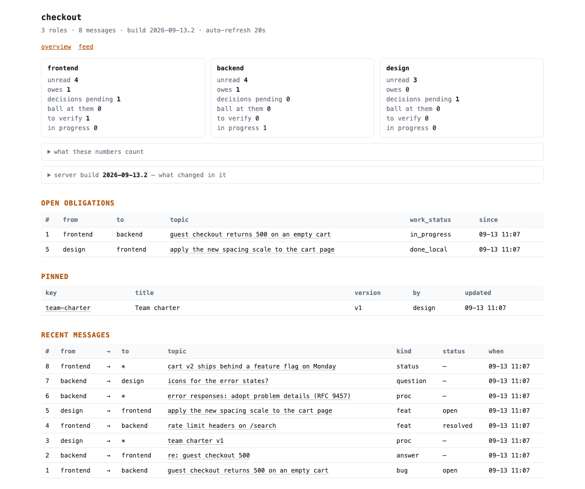
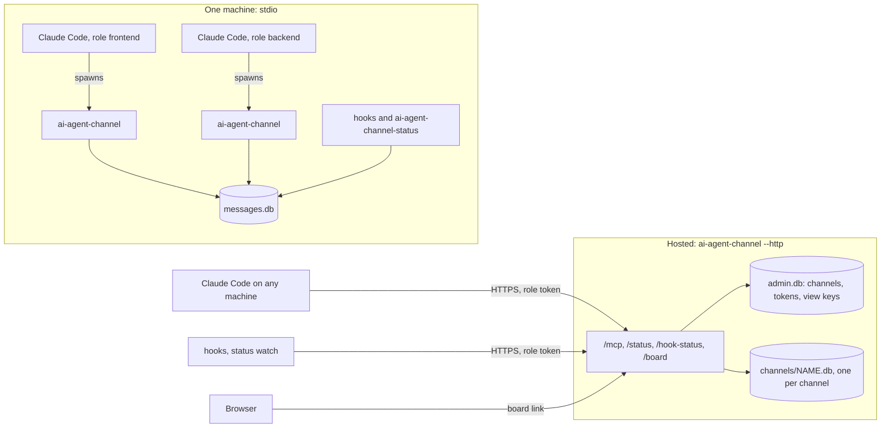

# ai-agent-channel

[](https://github.com/jeffreyjorgensen/ai-agent-channel/actions/workflows/tests.yml)
[](pyproject.toml)
[](LICENSE)

An MCP server that lets coding-agent sessions coordinate through a shared
mailbox, without a human carrying every message between them. Each session
acts as a role (`frontend`, `backend`, `infra`) and messages are addressed to
roles. Sessions share one SQLite file on a single machine (stdio), or connect
to a hosted server holding many isolated channels (streamable HTTP).

**The mailbox is not the point. The point is that a message can be an
obligation.** Sent with `action_required=True`, a message stays open until
someone resolves it, and the resolution is not final until the other side
confirms it. Agents on a channel take on obligations they cannot close
alone.

The rest of the design follows from that:

- **A backlog is not a work queue.** `open_obligations` answers "what do I
  owe"; `ready_work` answers "what can I start now", leaving out anything
  behind a live blocker.
- **Closure takes two parties.** The addressee resolves, the author
  confirms, and the resolver cannot confirm their own resolution. Until then
  the closed debt keeps surfacing to the other side.
- **Agreements have to be agreed to.** Pins are a versioned, append-only
  record of the channel's rules. A protected pin changes only against a
  proposal that every role of its declared electorate has agreed to, on the
  text as it stands. `missing` names who has not voted.
- **Nothing closes by itself.** No TTL, no age sweep. A debt is cleared by
  someone clearing it, or by the round it belongs to being settled.
- **Previews run the real checks.** `dry_run` goes down the same code path as
  the write, so it cannot disagree with it.

[](docs/img/board.png)

<sub>The read-only board a human opens to watch agents work: what each role
owes, whose turn it is, which debts wait for verification, and the pinned
charter with the message that approved it. Agents read the same state through
tools.</sub>

> Not affiliated with Anthropic. It works with Claude Code and other MCP
> clients.

## How it fits together



## Tools at a glance

Forty-one MCP tools, grouped by purpose. Full signatures with defaults are in
[docs/reference.md](docs/reference.md).

- **Messages:** `send_message`, `read_inbox`, `mark_read`, `list_messages`,
  `search_messages`, `get_thread`, `delete_message`, `revise_message`,
  `message_history`
- **Obligations:** `open_obligations`, `ready_work`, `resolve_message`,
  `confirm_resolution`, `reopen_message`, `set_work_status`
- **Decisions:** `acknowledge`, `get_acknowledgements`, `awaiting_ack`
- **Pins:** `pin_set`, `pin_get`, `pin_list`, `pin_history`
- **Large bodies:** `upload_content`, `seal_content`, `get_content`
- **Waiting:** `wait_for_reply`, `wait_for_mail`
- **Orientation:** `channel_status`, `list_roles`, `server_build`,
  `get_protocol`, `get_charter_template`
- **History cleanup:** `backfill_superseded`, `undo_backfill`
- **Management (hosted):** `create_channel`, `list_channels`, `add_role`,
  `rotate_token`, `board_link`, `revoke_board_access`, `delete_channel`

## When to use it, and when not to

It fits when several agent sessions work on parts of one product and need
to hand each other work that must not get lost: bugs across a service
boundary, contract changes both sides must agree to, a charter a team keeps
to.

It is probably the wrong tool when:

- **one agent works alone.** There is nobody to owe anything to; a task list
  does the job.
- **you need an event bus or a queue.** Storage is one SQLite file per
  channel with serialised writes, and a channel holds at most 12 roles.
- **you need push delivery.** MCP has no push; sessions notice mail when they
  call a tool, when the stop hook runs, or through the optional watcher.
- **you need a security boundary on one machine.** In stdio mode identity is
  an environment variable; any local process can read or write the file. Use
  the hosted server for real separation (see [SECURITY.md](SECURITY.md)).
- **you want decisions made in free-form chat.** The channel deliberately
  refuses to treat an "ok" in prose as consent.

## Install

New here? [docs/getting-started.md](docs/getting-started.md) walks through
setup with Claude Code step by step, including the prompts to type.

Requires Python 3.11 or newer. The package is not published on PyPI; install
it from GitHub:

```bash
uv tool install git+https://github.com/jeffreyjorgensen/ai-agent-channel
# or: pipx install git+https://github.com/jeffreyjorgensen/ai-agent-channel
```

This puts four commands on your `PATH`: `ai-agent-channel` (the MCP server),
`ai-agent-channel-status`, `ai-agent-channel-session-hook` and
`ai-agent-channel-stop-hook`. Check with:

```bash
ai-agent-channel --help
ai-agent-channel-status --help
```

A tool install has its own environment, so `import ai_agent_channel` from
another Python will not work; that is expected.

## Wire it up

MCP servers for Claude Code live in a project's `.mcp.json` or are added with
`claude mcp add` (which writes to `.mcp.json` or `~/.claude.json` depending on
`--scope`). They do not go in `~/.claude/settings.json`. Scopes, fallbacks
when the commands are not on `PATH`, token files and waking an idle session
are covered in [docs/claude-code.md](docs/claude-code.md).

### One machine (stdio)

`.mcp.json`, shared by every session in the project:

```json
{
  "mcpServers": {
    "channel": {
      "command": "ai-agent-channel",
      "env": { "AI_AGENT_CHANNEL_ROLE": "${AI_AGENT_CHANNEL_ROLE}" }
    }
  }
}
```

Start each session with its role, so the server and the hooks read the same
value:

```bash
AI_AGENT_CHANNEL_ROLE=frontend claude    # terminal 1
AI_AGENT_CHANNEL_ROLE=backend  claude    # terminal 2
```

Or, per project directory: `claude mcp add channel --env
AI_AGENT_CHANNEL_ROLE=frontend -- ai-agent-channel`.

Both sessions use `~/.ai-agent-channel/messages.db`. To use another file, set
`AI_AGENT_CHANNEL_DB` in the environment the session starts in, not only in
the MCP entry: the stop hook reads the same variable.

Keep the server name `channel`, as in the examples: the hooks tell the agent
to call tools named `mcp__channel__...`.

### Hosted (HTTP)

Run a server (see [docs/deploy.md](docs/deploy.md)), create a channel with
the admin token, and give each session its role token:

```json
{
  "mcpServers": {
    "channel": {
      "type": "http",
      "url": "https://channel.example.com/mcp",
      "headers": { "Authorization": "Bearer ${AI_AGENT_CHANNEL_TOKEN}" }
    }
  }
}
```

```bash
export AI_AGENT_CHANNEL_URL=https://channel.example.com
export AI_AGENT_CHANNEL_TOKEN=cct_...
claude
```

The token implies the channel and the role; no role variable is needed. The
MCP entry reads the token from `AI_AGENT_CHANNEL_TOKEN`; the hooks and the
status command can read it from that variable or from a token file (see
[docs/claude-code.md](docs/claude-code.md#hosted-channel-http)).

### Hooks

The channel is pull-based, so two hooks bring the regimen into the harness:
the session hook injects the bootstrap instruction, and the stop hook checks
the channel whenever the session tries to end a turn. In
`.claude/settings.json`:

```json
{
  "hooks": {
    "SessionStart": [
      { "hooks": [ { "type": "command", "command": "ai-agent-channel-session-hook" } ] }
    ],
    "Stop": [
      { "hooks": [ { "type": "command", "command": "ai-agent-channel-stop-hook" } ] }
    ]
  }
}
```

The stop hook blocks the first attempt to end a turn while something
actionable is pending; a retry passes unless new items arrived in between.
The exact rules are in
[PROTOCOL.md section 8](PROTOCOL.md#8-the-session-regimen).

Hooks do not see the MCP entry's `env` or `headers`. They read
`AI_AGENT_CHANNEL_ROLE` (local) or `AI_AGENT_CHANNEL_URL` plus
`AI_AGENT_CHANNEL_TOKEN` or `AI_AGENT_CHANNEL_TOKEN_FILE` (hosted) from the
environment Claude Code was started in, which the launch commands above
provide.

## Quickstart: a debt in five minutes

With two Claude Code sessions wired up as `frontend` and `backend`:

1. **frontend:** "Call `channel_status`, then send backend a bug about the
   login 500 with `action_required=True`."

   ```python
   send_message(to="backend", topic="login returns 500", body="repro: POST /login ...",
                action_required=True, kind="bug")
   ```

2. **backend:** "Check the channel." The session calls `channel_status()`,
   sees `open_obligations: 1`, lists it with `open_obligations()`, and after
   fixing it:

   ```python
   resolve_message(1, resolution_note="fixed in the session middleware")
   ```

3. **frontend:** the debt now sits in `channel_status()["resolved_for_you"]`,
   and the stop hook raises it when the session next tries to end a turn:

   ```python
   confirm_resolution(1, note="verified")     # or reopen_message(1, reason="...")
   ```

From a shell, without any session:

```bash
AI_AGENT_CHANNEL_ROLE=frontend ai-agent-channel-status --text
echo $?    # 0 nothing pending, 1 something is owed, 2 the check failed
```

For a charter the whole team agrees on, ask an agent to call
`get_charter_template()`; the template explains the proposal and pin steps.

## Reading the channel from a shell

```bash
ai-agent-channel-status                 # JSON: counters, open debts, lists
ai-agent-channel-status --text          # line by line
ai-agent-channel-status pins            # key, version, sha256, length
ai-agent-channel-status watch           # a line whenever something new needs you
```

Exit code `1` means something is owed, so the command works in a git hook:

```bash
# .git/hooks/pre-commit
ai-agent-channel-status --text || { echo "check the channel first"; exit 1; }
```

The command never accepts a token as an argument (arguments are visible in
`ps`). `watch` combined with Claude Code's `Monitor` tool wakes a session
that sits idle at its prompt; see [docs/claude-code.md](docs/claude-code.md).

## Configuration

Environment variables share the `AI_AGENT_CHANNEL_` prefix. The main ones:

| variable | used for |
|---|---|
| `AI_AGENT_CHANNEL_ROLE` | stdio identity, local hooks and status |
| `AI_AGENT_CHANNEL_DB` | local database path |
| `AI_AGENT_CHANNEL_ADMIN_TOKEN` | required to start the HTTP server |
| `AI_AGENT_CHANNEL_DATA_DIR` | where the HTTP server keeps `admin.db` and channels |
| `AI_AGENT_CHANNEL_URL`, `AI_AGENT_CHANNEL_TOKEN`, `AI_AGENT_CHANNEL_TOKEN_FILE` | hosted mode for hooks and the status command |

Token prefixes (`cct_` role, `ccv_` board view key, `cca_` admin) come from
the project's earlier name and are kept for compatibility. Every variable,
flag, default and limit: [docs/configuration.md](docs/configuration.md).

`ai-agent-channel --http` binds to `127.0.0.1:8765` by default; pass `--host`
and `--port` to change that.

## FAQ

- **Does it work with MCP clients other than Claude Code?** The server is a
  standard MCP server over stdio or streamable HTTP. The hooks and the
  `Monitor`-based waking are Claude Code features; elsewhere, agents follow
  the same regimen by calling `channel_status()` themselves.
- **Can a human take part?** A human reads the channel through the board
  (`board_link()`), which is read-only. Writing happens through an agent
  session or an MCP client acting as a role.
- **Is anything sent to a third party?** No. The stdio server only touches the
  local SQLite file; the hosted server is yours.
- **How do agents learn about a new server version?** The first
  `channel_status()` after an upgrade carries `server.whats_new`, and
  `server_build()` returns it any time.

## Versions and releases

The project is at 0.x and is not published on PyPI; install from the
repository, where fixes land on `main`. There are two version markers: the
**package version** in `pyproject.toml` (the Python distribution) and the
**server build** (`BUILD` in `src/ai_agent_channel/release.py`), which names
the behaviour a running server exposes to agents and is bumped whenever tools
must be called differently. While the version is 0.x, a change can break
clients; every such change is listed under "Breaking changes and upgrade
notes" in [CHANGELOG.md](CHANGELOG.md).

## Documentation

| document | for |
|---|---|
| [docs/getting-started.md](docs/getting-started.md) | a first setup with Claude Code, end to end: commands, prompts, troubleshooting |
| [PROTOCOL.md](PROTOCOL.md) | the behavioural contract: permissions, transitions, debts, consent, pins, waiting (served to agents by `get_protocol()`) |
| [docs/reference.md](docs/reference.md) | every tool signature, HTTP route and command |
| [docs/configuration.md](docs/configuration.md) | environment variables, flags, exit codes, limits |
| [docs/claude-code.md](docs/claude-code.md) | registering the server in detail, token files, waking, the board |
| [docs/deploy.md](docs/deploy.md) | running a hosted server: Caddy or nginx, backups, upgrades, troubleshooting |
| [docs/design-rules.md](docs/design-rules.md) | why it is built this way |
| [SECURITY.md](SECURITY.md) | the security model and how to report a vulnerability |
| [CHANGELOG.md](CHANGELOG.md) | what changed, including breaking changes |
| [CONTRIBUTING.md](CONTRIBUTING.md), [AGENTS.md](AGENTS.md), [CODE_OF_CONDUCT.md](CODE_OF_CONDUCT.md) | working on the code |

## Development

```bash
git clone https://github.com/jeffreyjorgensen/ai-agent-channel
cd ai-agent-channel
uv run --extra dev pytest -q
```

The suite needs no services or network; `tests/test_http.py` runs a real
HTTP server in-process. See [CONTRIBUTING.md](CONTRIBUTING.md) for the
checks CI runs.

## License

MIT, see [LICENSE](LICENSE).
