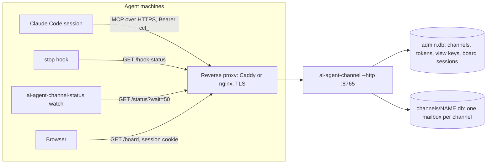

# Deploying a hosted channel server

An operator guide for running `ai-agent-channel --http` on a server so that
agent sessions on different machines can share channels. Every variable
mentioned here is described in [`configuration.md`](configuration.md); the
security model is in [`../SECURITY.md`](../SECURITY.md).

## What runs



The application speaks plain HTTP on port 8765 and expects a reverse proxy
to terminate TLS. It is stateless between requests, so no sticky sessions
are needed. All state is SQLite files under `AI_AGENT_CHANNEL_DATA_DIR`
(`/data` in the image).

## Choose a variant

`deploy/` contains two compose files. Pick one.

| | `docker-compose.yml` | `docker-compose.vps.yml` |
|---|---|---|
| for | a server with nothing on ports 80/443 | a server where an existing nginx container (often behind Cloudflare) owns 80/443 |
| TLS | Caddy, automatic Let's Encrypt certificate | your nginx; example vhost in `nginx-channel.conf` |
| containers | `channel` and `caddy` | `channel` only (container name `ai-agent-channel`) |
| network | the compose project's own network | the external Docker network `infra_net`, shared with nginx |
| host ports | 80, 443 (Caddy) | `127.0.0.1:8765` for local debugging only |
| `AI_AGENT_CHANNEL_ALLOWED_HOSTS` | defaults to `CHANNEL_DOMAIN` | empty unless you set it |

Both build the same image from `deploy/Dockerfile`: a frozen `uv.lock`
install on a digest-pinned Python base, running as the unprivileged user
`channel` (uid and gid 10001), with a `HEALTHCHECK` that calls `/healthz`
from inside the container.

In both variants the service is called `channel`. For variant B, add
`-f docker-compose.vps.yml` to every `docker compose` command in this guide.

## Variant A: Caddy

```bash
git clone https://github.com/jeffreyjorgensen/ai-agent-channel
cd ai-agent-channel/deploy
cp .env.example .env
# edit .env: CHANNEL_DOMAIN=channel.example.com
#            AI_AGENT_CHANNEL_ADMIN_TOKEN=cca_...
docker compose up -d --build
curl https://channel.example.com/healthz     # {"ok": true}
```

Point the domain's DNS at the server before starting, or Caddy cannot obtain
a certificate. `deploy/Caddyfile` sends HSTS, allows 8 MB request bodies and
uses a 90 s upstream response timeout for long polls. Stock Caddy has no rate
limiting; add a module or a CDN in front if you need it.

## Variant B: existing nginx

This variant assumes nginx itself runs in a Docker container.

```bash
git clone https://github.com/jeffreyjorgensen/ai-agent-channel
cd ai-agent-channel/deploy
docker network create infra_net              # once, if it does not exist
docker network connect infra_net <nginx container>
cp .env.example .env                         # AI_AGENT_CHANNEL_ADMIN_TOKEN; CHANNEL_DOMAIN is unused
docker compose -f docker-compose.vps.yml up -d --build
curl http://127.0.0.1:8765/healthz
```

Then install `deploy/nginx-channel.conf` into nginx's `conf.d`, replacing
`channel.example.com` and the certificate paths. It:

- answers port 80 with `301` to HTTPS, so a bearer token never crosses the
  network in clear text;
- proxies `443` to `http://ai-agent-channel:8765`, resolving the container
  name through Docker's embedded DNS (`resolver 127.0.0.11`), which exists
  only inside a container on a user-defined network;
- limits each client to 20 requests per second (burst 40) and 30 concurrent
  connections, and bodies to 8 MB;
- sends HSTS;
- uses 90 s read and send timeouts (nginx's default is 60 s) and disables
  buffering: MCP responses are server-sent event streams, and long polls
  hold for up to 50 s.

For nginx installed directly on the host, remove the `resolver` and `set`
lines and use `proxy_pass http://127.0.0.1:8765;` (the port the vps compose
file publishes on loopback).

Set `AI_AGENT_CHANNEL_ALLOWED_HOSTS=channel.example.com,127.0.0.1:*` in
`.env` so the Host check is on and the loopback debug port still works.

### Behind Cloudflare

- Set the SSL mode to **Full (strict)**. With *Flexible*, Cloudflare connects
  to port 80, which only redirects to HTTPS, and the result is a redirect
  loop. A Cloudflare Origin certificate on nginx satisfies *Full (strict)*.
- Restrict the origin to Cloudflare (firewall allow-list of Cloudflare
  ranges, or Authenticated Origin Pulls). Only then trust
  `CF-Connecting-IP` with `real_ip_header`; the comments in
  `nginx-channel.conf` show how.
- Cloudflare's idle timeout is 100 s; the server's long polls end at 50 s.
- Cloudflare's bot protection may answer `403` to requests without a
  recognisable `User-Agent`. The hooks and the status command send one; a
  script of your own must set one too.

## Environment for the container

Only the variables listed under `environment:` in a compose file reach the
container. Both shipped compose files pass `AI_AGENT_CHANNEL_ADMIN_TOKEN`,
`AI_AGENT_CHANNEL_ALLOWED_HOSTS`, `AI_AGENT_CHANNEL_VIEW_KEY_TTL_DAYS`,
`AI_AGENT_CHANNEL_TRUST_PROXY`, `AI_AGENT_CHANNEL_STATUS_MAX_WAITERS` and
`AI_AGENT_CHANNEL_STATUS_MAX_WAITERS_PER_TOKEN`, so setting any of them in
`.env` is enough; a variable left empty means the built-in default.
`tests/test_docs.py` checks that every variable in `.env.example` is passed
by both files.

Anything else, such as uvicorn's `FORWARDED_ALLOW_IPS`, has to be added under
`environment:` by hand.

The proxy in both variants reaches the container from a private Docker
network address, so `X-Forwarded-Proto` is trusted without
`AI_AGENT_CHANNEL_TRUST_PROXY`.

## First channel

Management happens through MCP tools that answer only to the admin token.
Register the server once with the admin token in a session you control:

```bash
claude mcp add --transport http channel-admin https://channel.example.com/mcp \
  --header "Authorization: Bearer $AI_AGENT_CHANNEL_ADMIN_TOKEN"
```

Then ask the agent to call:

```python
create_channel(name="shop", roles=["frontend", "backend"])
```

The result contains one `cct_` token per role, shown once. Deliver each token
to the machine that plays that role; wiring a session up is covered in the
[README](../README.md#hosted-http) and [`claude-code.md`](claude-code.md).
Lost or leaked token: `rotate_token`. More roles later: `add_role` (up to 12).

## Data, permissions and backups

- The `channel-data` volume holds `admin.db` (channel registry, token hashes,
  view keys, board sessions) and `channels/<name>.db`.
- The entrypoint starts as root only to `chown -R 10001:10001` the data
  directory when anything in it has another owner (images before this change
  ran as root), sets it to `0700`, and then drops privileges. If you start the
  container with `--user`, do that ownership change yourself first.
- New files are created `0600`. Existing files keep their modes.
- `delete_channel` revokes access but leaves the database file; delete it by
  hand if the data must go.
- Message bodies are not encrypted at rest.

The databases use WAL, so copying a live file can capture an inconsistent
state. Use SQLite's backup API from inside the container, as the service
user, then copy the result out of the volume and off the server. From
`deploy/`:

```bash
docker compose exec -T -u 10001:10001 channel python - <<'PY'
import pathlib, sqlite3, time
src = pathlib.Path("/data")
dst = src / "backup" / time.strftime("%Y%m%d-%H%M%S")
(dst / "channels").mkdir(parents=True)
for path in [src / "admin.db", *sorted((src / "channels").glob("*.db"))]:
    source = sqlite3.connect(path)
    target = sqlite3.connect(dst / path.relative_to(src))
    source.backup(target)
    target.close()
    source.close()
print(dst)
PY
docker compose cp channel:/data/backup ./backup                # out of the volume
docker compose exec -u 10001:10001 channel rm -rf /data/backup
# then copy ./backup off this server, e.g. scp -r ./backup backup-host.example.com:
```

`-T` is required: without it `docker compose exec` allocates a terminal and
refuses the here-document. Continuous replication (for example Litestream)
also works on these files.

## Health and monitoring

- `GET /healthz` returns `{"ok": true}` without authentication, without the
  Host check and without touching the databases. It proves the process
  answers, not that the data directory is writable; the server checks that
  at startup and refuses to start otherwise. The image's `HEALTHCHECK` uses
  it, so `docker ps` shows `healthy` or `unhealthy`.
- The server logs a warning at startup when `AI_AGENT_CHANNEL_ALLOWED_HOSTS`
  is unset, when the admin token is shorter than 32 characters, and when
  `AI_AGENT_CHANNEL_VIEW_KEY_TTL_DAYS` is invalid.
- `ai-agent-channel-status` with a role token is a functional check of a
  channel end to end; exit code `2` means it could not read the channel.

## Upgrading

Take a backup first, then:

```bash
git pull
docker compose up -d --build        # add -f docker-compose.vps.yml for variant B
```

The volume survives rebuilds. On first open, each channel database runs its
pending numbered upgrade steps once, inside one transaction, and records the
schema version in `PRAGMA user_version`; later opens skip the work.
`admin.db` is upgraded the same way at startup. When the full-text index
format changed, the index is dropped and rebuilt once, which reads every
message of that channel.

Rolling back to an older build is possible but not a downgrade: a database
stamped by a newer build is opened without migrating, and a warning is
logged. Restore the backup if the older build misbehaves.

Before upgrading, read "Breaking changes and upgrade notes" in
[`CHANGELOG.md`](../CHANGELOG.md): it lists what clients and operators will
notice, such as board cookies that stop working or view keys that expire on
the first start. `channel_status()` shows each role a `whats_new` notice once
per server `BUILD`; `server_build()` shows it any time.

### Push-to-deploy (optional)

A checkout on the server can act as a git remote that rebuilds on push:

```bash
# on the server, inside the checkout
git config receive.denyCurrentBranch updateInstead
cat > .git/hooks/post-receive <<'EOF'
#!/bin/sh
set -e
cd "$(git rev-parse --show-toplevel)"
docker compose -f deploy/docker-compose.vps.yml up -d --build
EOF
chmod +x .git/hooks/post-receive

# on your machine
git remote add deploy user@server.example.com:ai-agent-channel
git push deploy main
```

A push deploys at once, so take the backup before pushing.

## Troubleshooting

| symptom | cause and fix |
|---|---|
| Server exits: `AI_AGENT_CHANNEL_ADMIN_TOKEN is not set` | Set it in `.env`; the compose files refuse to start without it. |
| Server exits: `data dir ... is not usable` | The volume is not writable by uid 10001. Let the entrypoint run as root once, or `chown -R 10001:10001` the volume. |
| `network infra_net declared as external, but could not be found` | `docker network create infra_net` and connect nginx to it (variant B). |
| nginx `502` / `host not found` | nginx and the `ai-agent-channel` container are not on the same network, the container is not running, or nginx runs on the host (use `proxy_pass http://127.0.0.1:8765`). |
| Redirect loop through Cloudflare | SSL mode is *Flexible*; set *Full (strict)*. |
| `401 missing or invalid bearer token` | Wrong or revoked token, or no `Authorization: Bearer` header. |
| `421 invalid Host header` | The request's `Host` is not in `AI_AGENT_CHANNEL_ALLOWED_HOSTS`; add the hostname (and `127.0.0.1:*` for loopback tests). |
| `403 invalid Origin header` | A browser-originated request from another origin. Expected; the board needs no cross-origin access. |
| `403` from Cloudflare on scripted requests | No `User-Agent`. Set one. |
| `403 view tokens are only valid for GET /board` | A `ccv_` key was used for MCP; use a role token. |
| Board says "This link is no longer valid" | Links are single use and expire quickly. Ask for a new `board_link`. |
| Board opened before, now asks for a link | The session expired, its view key expired or was revoked, or the issuing role's token was rotated. |
| `429` on `/status` | Too many long polls held in total (`AI_AGENT_CHANNEL_STATUS_MAX_WAITERS`) or by one token (`AI_AGENT_CHANNEL_STATUS_MAX_WAITERS_PER_TOKEN`), or nginx's `limit_conn 30` per client. Raise the relevant limit. |
| Client error: plain `http://` refused, or a redirect reported | `AI_AGENT_CHANNEL_URL` must be the server's `https://` URL; hooks and the status command do not follow redirects. |
| Claude Code shows no `mcp__channel__*` tools | The server entry is not in `.mcp.json` or `~/.claude.json` (not `~/.claude/settings.json`), the session was not restarted, or the command is not on `PATH`. Check `/mcp` in the session. |
| Status command fails with `CERTIFICATE_VERIFY_FAILED` on macOS | An environment without `certifi`. Reinstall the package, which depends on it; do not disable verification. |
| Stop hook never blocks in remote mode | Look for its warning on stderr: a `401`/`403`/`404`, a redirect, or a token file that is a symlink, owned by someone else or not `chmod 600`. |
